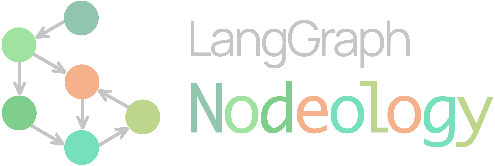

<div align="center">
  
  <h3></h3>
</div>

`nodeology` is an experimental framework that leverages foundational AI agents to supercharge scientific research. Built on `langgraph`, it enables researchers to quickly develop, test, adapt and run agentic workflows. By combining the power of foundational AI with graph-based workflow, Nodeology has the potential to transform complex research tasks into streamlined, AI-enhanced processes. Some potential applications are:
- Automate parameter optimization
- Generate and validate hypotheses
- Extract insights from research paper
- AI-driven decision making
- Human-in-the-loop experiment control

## 🎯 Key Features

- **Simplicity First**: Complex workflows shouldn't require complex code
- **Composability**: Self-contained units that combine into powerful workflows
- **Scientific Focus**: Specialized components for research tasks
- **Flexibility**: Easy to extend while maintaining consistency

## 🏗️ Concepts & Design

### State Machine

At its core, Nodeology uses a state machine pattern to manage workflow execution. This provides:
- Clear execution flow
- Predictable state transitions
- Type-safe data handling
- Built-in error recovery

Define your workflow state with type hints:

```python
from nodeology.state import State
from typing import Dict, List, Union

class DataProcessingState(State):
    data_path: str
    result_path: str
    params_desc: str
    params: Dict[str, Union[float, str, int, bool]]
    quality: str
    quality_history: List[str]
    previous_results: List[str]
    next_steps: str
```

Pre-built states are available for common scenarios:
```python
from nodeology.prebuilt import (
    ComputationalTaskState,  # For computational tasks
    ParamsOptState,          # For parameter optimization
    HilpState,               # For human-in-the-loop processes
    KnowledgeState,          # For knowledge extraction
    RAGState                 # For retrieval-augmented generation
)
```

### 🧩 Nodes: Flexible Building Blocks

**Prompt-Based Nodes**: use `{}` to reference your state variables
```python
from nodeology.node import Node

analyzer = Node(
    name="experiment_data_analyzer",
    prompt_template="""
    Analyze experiment data and suggest next steps:
    Data: {data_path}
    Previous Results: {previous_results}
    """,
    sink="next_steps",
)
```

**Function-Based Nodes**: transform conventional `python` functions
```python
@as_node(name="processor", sink=["result_path", "quality"])
def process_experiment_data():
    # Your processing logic here
    # You will have access to state variables (e.g. state["data_path"])
    return result_path, quality
```

**Pre-built Research Nodes**: reusable components in scientific workflows
```python
from nodeology.prebuilt import (
    # From reasoning.py
    "planner": planner,
    # From coding.py
    "code_executor": execute_code,
    "code_rewriter": code_rewriter,
    "error_corrector": error_corrector,
    "code_tweaker": code_tweaker,
    "code_explainer": code_explainer,
    "code_designer": code_designer,
    # From knowledge.py
    "pdf2md_converter": pdf2md,
    "content_summarizer": content_summarizer,
    "attributes_extractor": attributes_extractor,
    "effect_analyzer": effect_analyzer,
    "questions_generator": questions_generator,
    "log_summarizer": log_summarizer,
    "insights_extractor": insights_extractor,
    "context_searcher": context_retriever,
    "rag_generator": context_augmented_generator,
    # From params.py
    "formatter": formatter,
    "recommender": recommender,
    "updater": updater,
    # From hilp.py
    "conversation_summarizer": conversation_summarizer,
    "survey": survey,
    # From diagnosis.py
    "commentator": commentator,
)
```
You can customize those prebuilt nodes using `source` keyword arguments.

### 🔄 Building Workflows

**Class-Based Definition**: use conventional `langraph` syntax
```python
class ResearchWorkflow(Workflow):
    def create_workflow(self):
        self.workflow = StateGraph(self.state_schema)

        self.workflow.add_node("design", code_designer)
        self.workflow.add_node("process", processor)
        self.workflow.add_node("analyze", analyzer)
        
        self.workflow.add_edge("design", "process")
        self.workflow.add_conditional_edges(
            "process",
            condition=lambda state: state["quality"] > 0.95,
            destinations={"true": END, "false": "analyze"}  
        ) 
        self.workflow.add_edge("analyze", "design")
        
        self.workflow.set_entry_point("design")
        self.graph = self.workflow.compile(checkpointer=MemorySaver())
```
After defining the workflow, simply
```python
my_workflow = ResearchWorkflow(
    name="data_processing_workflow",
    state_defs=DataProcessingState,
    llm_name="gpt-4o",
    vlm_name="gpt-4o",
    exit_commands=["quit now"],
)
my_workflow.run({'data_path':'my_data_path', 'params_desc':'parameter context'})
```

**YAML Template**: Alternatively you can use the template system
```yaml
name: data_processing_workflow
state_defs:
  - [data_path, str]
  - [result_path, str]
  - [params_desc, str]
  - [params, "Dict[str, Union[float, str, int, bool]]"]
  - [quality, float]
  - [quality_history, "List[float]"]
  - [previous_results, "List[str]"]
  - [next_steps, str]

nodes:
  design:
    type: code_designer
    next: process

  process:
    type: processor
    next:
      condition: "state['quality'] > 0.95"
      then: END
      else: analyze

  analyze:
    type: analyzer
    template: |
      Analyze ${experiment_type} experiment data and suggest next steps:
      Data: {data_path}
      Previous Results: {previous_results}
    sink: next_steps
    next: design

entry_point: design
```
Then, you can 
```python
from nodeology.workflow import load_workflow_from_template

workflow = load_workflow_from_template(
    "path/to/research_workflow.yaml",
    custom_nodes={'processor': process_experiment_data}
    experiment_type="XRF"  
)
results = workflow.run({'data_path':'my_data_path', 'params_desc':'parameter context'})
```

## 🔬 Featured Applications

* [PEAR: A Robust and Flexible Automation Framework for Ptychography Enabled by Multiple Large Language Model Agents.](https://arxiv.org/abs/2410.09034) You can check a demo implementation in the example folder.


## 👥 Contributing & Collaboration

We welcome contributions and collaborations from the community! Whether you want to:
- Report bugs or suggest features
- Submit pull requests
- Explore research collaborations
- Share your use cases and feedback

Please feel free to reach out via email at [xyin@anl.gov]

